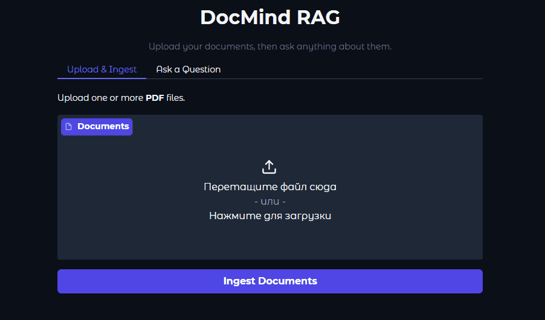

# DocMind — Document Q&A with RAG

A local RAG pipeline that lets you drop in PDF documents and ask questions about them. Built on top of a small quantized LLM so it runs without a GPU cloud bill.



---

## How it works

```
PDF files  →  Parse  →  Chunk  →  Embed  →  Qdrant
                                               ↓
User query  →  Embed  →  Retrieve  →  Generate  →  Answer
```

1. **Parse** — extracts text and page metadata from PDFs 
2. **Chunk** — splits text into overlapping windows
3. **Embed** — encodes chunks with `all-MiniLM-L6-v2` and upserts into Qdrant
4. **Retrieve** — embeds the query, runs cosine similarity search, returns top-k passages above a score threshold
5. **Generate** — builds a prompt with retrieved context and runs `Qwen2.5-0.5B-Instruct` (4-bit quantized) to produce a cited answer

The LLM is told to answer only from the provided context and to cite `(filename, page N)` for every claim.

---

## Stack

| Layer | Tool |
|---|---|
| PDF parsing | PyMuPDF |
| Chunking | LangChain text splitter |
| Embeddings | sentence-transformers `all-MiniLM-L6-v2` |
| Vector DB | Qdrant (Docker) |
| LLM | `Qwen/Qwen2.5-0.5B-Instruct` via HuggingFace |
| Quantization | BitsAndBytes 4-bit (nf4) |
| UI | Gradio |

---

## Setup

**1. Start Qdrant**

```bash
docker compose up -d
```

Runs Qdrant at `localhost:6333`. Data is persisted in `./qdrant_storage`.

**2. Install dependencies**

```bash
pip install -r requirements.txt
```

**3. Configure** *(optional)*

`config/config.yaml` — adjust chunk size, embedding model, LLM checkpoint, generation params.
`config/qdrant_config.yaml` — change host/port/collection if needed.

---

## Usage

### Gradio UI

```bash
python -m app.gradio_app
```

Opens at `http://localhost:7860`.
Upload PDFs on the first tab, ask questions on the second.

### CLI

**Ingest** documents from `./data` (default) or a custom folder:

```bash
# uses ./data and collection from qdrant_config.yaml
python -m src.pipeline.ingestion_pipeline

# override folder and collection
python -m src.pipeline.ingestion_pipeline --data-folder ./my_docs --collection my_collection
```

**Query** the ingested documents:

```bash
# minimal
python -m src.pipeline.query_pipeline --query "What was the income in Q2?"

# override retrieval params
python -m src.pipeline.query_pipeline -q "What was the MMLU benchmark scores for my LM?" --top-k 8 --threshold 0.4

# target a different collection
python -m src.pipeline.query_pipeline -q "What is X?" --collection my_collection
```

**All arguments:**

| Pipeline | Argument | Short | Default | Description |
|---|---|---|---|---|
| ingest | `--data-folder` | `-d` | `config.yaml` value | Folder with PDFs to ingest |
| ingest | `--collection` | `-c` | `qdrant_config.yaml` value | Qdrant collection name |
| query | `--query` | `-q` | — *(required)* | Question to ask |
| query | `--top-k` | `-k` | `config.yaml` value | Chunks to retrieve |
| query | `--threshold` | `-t` | `config.yaml` value | Min similarity score |
| query | `--collection` | `-c` | `qdrant_config.yaml` value | Qdrant collection to query |

---

## Configuration reference

```yaml
# config/config.yaml

chunk_config:
  chunk_size: 1000
  chunk_overlap: 200

embed_config:
  embedding_model_ckpt: all-MiniLM-L6-v2
  vector_dim: 384

retrieve_config:
  top_k: 5
  threshold_score: 0.3    # passages below this score are dropped

generate_config:  
  model_ckpt: Qwen/Qwen2.5-0.5B-Instruct
  temperature: 0.7
  max_new_tokens: 512
```

---

## Notes

- Models are loaded once at startup via singletons in `shared.py` - first query is slow, subsequent ones are fast.
- The LLM runs in 4-bit quantization so it fits in ~2–3 GB VRAM. CPU fallback works but is slow.
- The system prompt enforces citation and prohibits hallucination outside the retrieved context.
